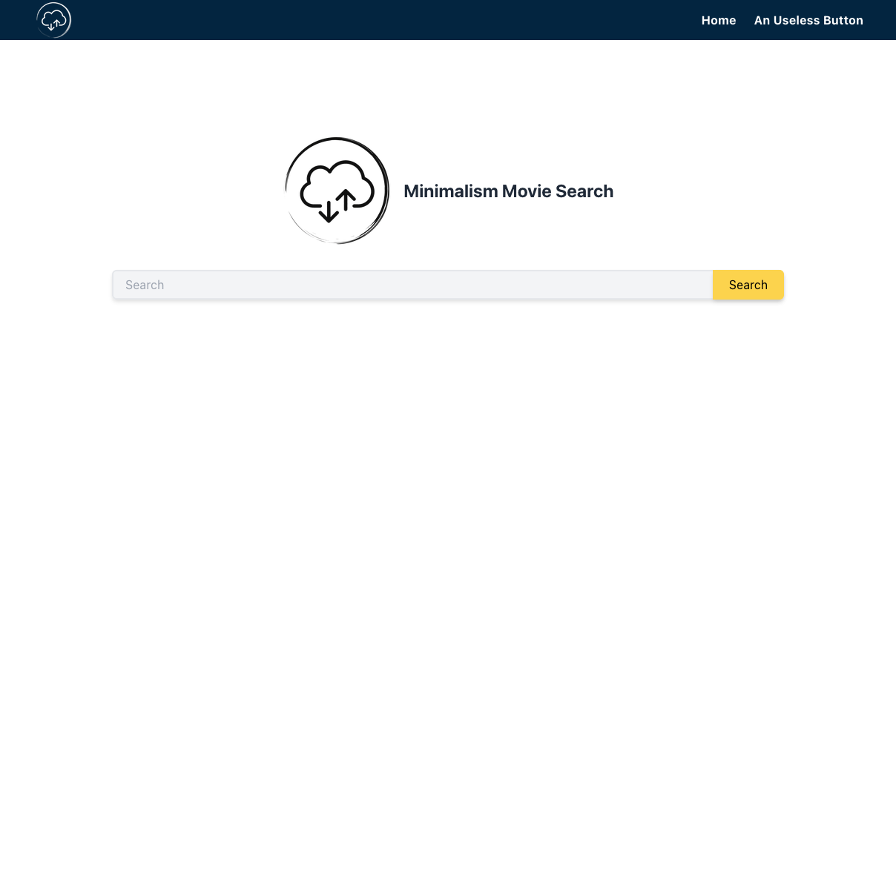
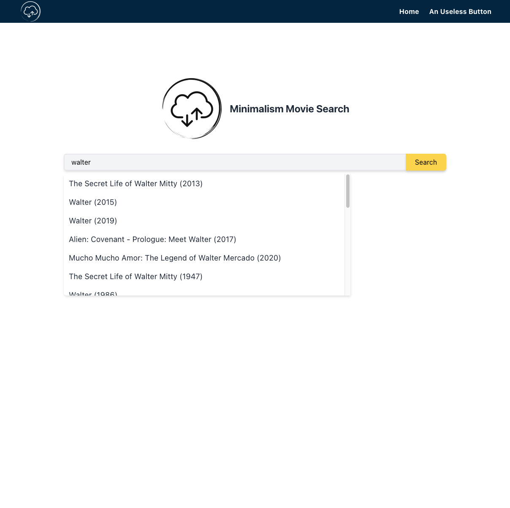
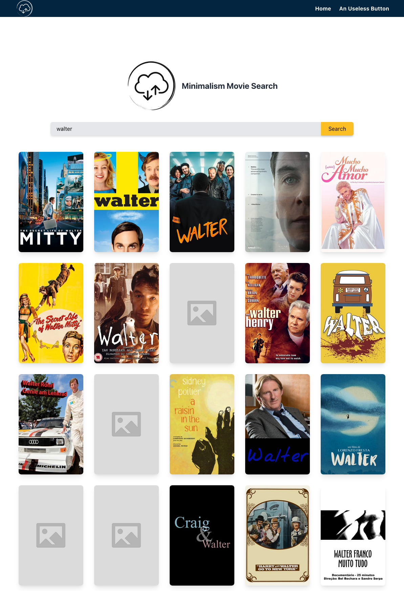
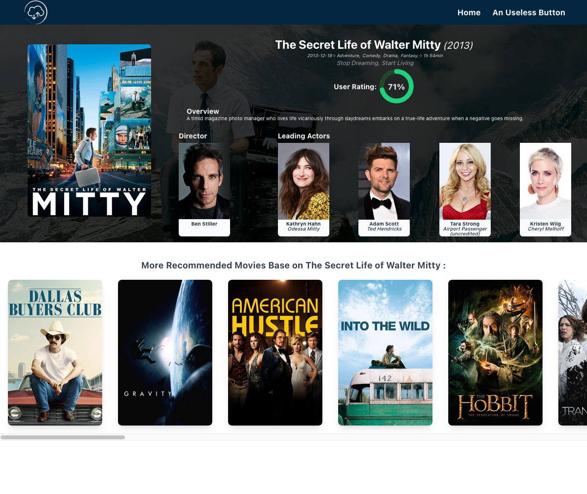

# The Minimalism Movie Search

> - This is a super simple searching app that searches for real basic movie information.

## Table of Contents

- [General Info](#general-information)
- [Screenshots](#screenshots)
- [Setup](#setup)

## General Information

- The aim of this project is to demonstrate the use of React/Redux, Node.js, and TypeScript. And also want to try to prove some of my residual design sense.🤣

## Screenshots

- Home Page: <br />
  

- Home Page while searching: <br />
  

- Home Page search results: <br />
  

- Movie detail page: <br />
  

## Setup

- The Server

  - To run the server, `cd` to the server folder and install packages using npm
    ```
    $ cd server
    $ npm install
    $ npm run
    ```
  - You need to have your own `.env` file, which should include the info below:
    ```
    TMDB_DOMAIN = "https://api.themoviedb.org/3"
    TMDB_API_KEY = "thdb API key "
    PORT=8080
    ```

- The Client
  - To run the server, `cd` to the client folder and install packages using npm
    ```
    $ cd client
    $ npm install
    $ npm run
    ```
  - You also need your own `.env` file, which should include the info below:
    ```
    ## Here is the URLs for this env file:
    REACT_APP_API_BASE_URL = 'http://localhost:8080/api'
    REACT_APP_POSTER_W500_API_BASE_URL = 'https://image.tmdb.org/t/p/w500'
    REACT_APP_POSTER_185_API_BASE_URL = 'https://image.tmdb.org/t/p/w185'
    REACT_APP_BACKDROP_ORIGINAL_API_BASE_URL = 'https://image.tmdb.org/t/p/original'
    ```
- Or you can use my pre-filled env info in the `env.zip` file
  - copy the content of `server env.txt` and create a `.env` in the server root folder
  - copy the content of `client env.txt` and create a `.env` in the client root folder
  - You are good to go